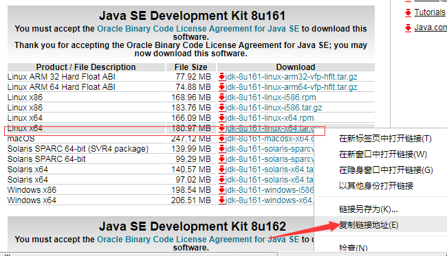
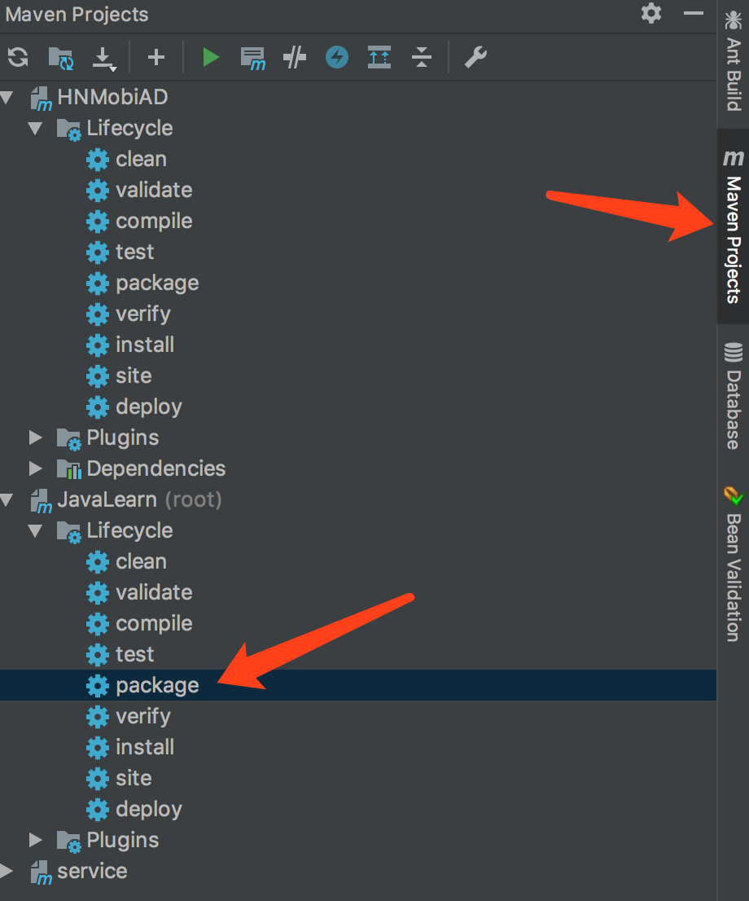

阿里云服务器学习之旅
------------
### 1. 登入阿里云官网购买ECS实例
实例配置信息：   
CPU： 2核  
内存： 4 GB   
实例类型： I/O优化   
操作系统： CentOS 7.4 64位     


### 2. Mac连接ECS实例
打开终端    
```bash
$ ssh root@阿里云公网IP
Are you sure you want to continue connecting (yes/no)? 
$ yes
```
然后输入密码，就可以正常登入了。

### 3. 安装jdk
(1) wget命令下载方式  
复制安装包下载路径：
   
执行wget命令：  
```bash
wget --no-cookies --header "Cookie: oraclelicense=accept-securebackup-cookie;" https://download.oracle.com/otn-pub/java/jdk/8u202-b08/1961070e4c9b4e26a04e7f5a083f551e/jdk-8u202-linux-x64.tar.gz
```   
(2) 解压  
切换到安装包保存目录，解压到指定目录：   
```bash
tar -zxvf jdk-8u202-linux-x64.tar.gz -C /usr/local/
```      
(3) 配置环境变量   
打开系统环境变量配置文件：   
```bash
vim /etc/profile
```   
在profile文件末尾加上如下内容：   
```bash
## JAVA
JAVA_HOME=/usr/local/jdk1.8.0_202
JRE_HOME=/usr/local/jdk1.8.0_202/jre
PATH=$PATH:$JAVA_HOME/bin:$JRE_HOME/bin
CLASSPATH=.:$JAVA_HOME/lib/dt.jar:$JAVA_HOME/lib/tools.jar:$JRE_HOME/lib
export JAVA_HOME JRE_HOME PATH CLASSPATH
```    
按esc之后输入的是 :q 和 :wq ，这两个都可以保存退出vim操作。   
(4) 配置文件生效   
为了使得配置文件立即生效，执行如下命令   
```bash
source /etc/profile
```    
(5) 检测java环境  
```bash
java -version
```    

### 4. 安装MySql  
**通过yum安装最新MySQL**  
(1) 去官网查看最新安装包： [MySql](https://dev.mysql.com/downloads/repo/yum/)    
(2) 下载MySQL源安装包   
```bash
wget http://dev.mysql.com/get/mysql57-community-release-el7-11.noarch.rpm
```    
(3) 安装MySql源   
```bash
yum -y install mysql57-community-release-el7-11.noarch.rpm
```   
(4) 查看一下安装效果   
```bash
yum repolist enabled | grep mysql.*
```   
(5) 安装MySQL服务器  
```bash
yum install mysql-community-server
```  
中间会弹出是与否的选择，一路选择y即可，然后耐心等待吧。。。。。。。   
(6) 启动MySQL服务  
```bash
systemctl start  mysqld.service
```  
运行一下命令查看一下运行状态  
```bash
systemctl status mysqld.service
```   
```bash
● mysqld.service - MySQL Server
   Loaded: loaded (/usr/lib/systemd/system/mysqld.service; enabled; vendor preset: disabled)
   Active: active (running) since 六 2019-01-19 11:37:57 CST; 7s ago
     Docs: man:mysqld(8)
           http://dev.mysql.com/doc/refman/en/using-systemd.html
  Process: 5940 ExecStart=/usr/sbin/mysqld --daemonize --pid-file=/var/run/mysqld/mysqld.pid $MYSQLD_OPTS (code=exited, status=0/SUCCESS)
  Process: 5865 ExecStartPre=/usr/bin/mysqld_pre_systemd (code=exited, status=0/SUCCESS)
 Main PID: 5943 (mysqld)
   CGroup: /system.slice/mysqld.service
           └─5943 /usr/sbin/mysqld --daemonize --pid-file=/var/run/mysqld/mys...

1月 19 11:37:51 izj6c849t7myjofypzxzytz systemd[1]: Starting MySQL Server...
1月 19 11:37:57 izj6c849t7myjofypzxzytz systemd[1]: Started MySQL Server.
```   
(7) 初始化数据库密码  
查看一下初始密码   
> 为了加强安全性，MySQL5.7为root用户随机生成了一个密码，在error log中，关于error log的位置，如果安装的是RPM包，则默认是/var/log/mysqld.log。
  只有启动过一次mysql才可以查看初始密码
```bash
grep "password" /var/log/mysqld.log
```   
使用默认的密码登陆  
```bash
mysql -uroot -p
```   
用该密码登录到服务端后，必须马上修改密码再执行一些数据库操作，不然会报如下错误：
```bash
mysql> select @@log_error;
ERROR 1820 (HY000): You must reset your password using ALTER USER statement before executing this statement.
mysql>
```    
修改密码（注意，登录后的操作后面都最好要有;结尾）   
```bash
ALTER USER 'root'@'localhost' IDENTIFIED BY '***';
```  
> mysql默认安装了密码安全检查插件（validate_password），默认密码检查策略要求密码必须包含：
大小写字母、数字和特殊符号，并且长度不能少于8位。否则会提示ERROR 1819 (HY000):
 Your password does not satisfy the current policy requirements错误   

如何解决ERROR 1819 (HY000): Your password does not satisfy the current policy requirements呢？    
必须修改两个全局参数：
首先，修改validate_password_policy参数的值   
```bash
mysql> set global validate_password_policy=0;
```   
再修改密码的长度   
```bash
set global validate_password_length=1;
```   
再次执行修改密码就可以了  
```bash
ALTER USER 'root'@'localhost' IDENTIFIED BY 'root123';（ALTER等可以写成小写）
```   
(8) 授权其他机器登陆  
数据库没有授权，只支持localhost本地访问  
```bash
GRANT ALL PRIVILEGES ON *.* TO 'root'@'%' IDENTIFIED BY 'yourpassword' WITH GRANT OPTION;
```   
远程连接数据库的时候需要输入用户名和密码  
用户名：root    
密码:123456    
指定ip:%代表所有Ip,此处也可以输入Ip来指定Ip    
输入后使修改生效还需要下面的语句:
```bash
FLUSH PRIVILEGES;
```    
也可以通过修改表来实现远程：
```bash
mysql> -u root -p
mysql> use mysql; 
mysql> update user set host = '%' where user = 'root'; 
mysql> select host, user from user;
```    
(9) 设置自动启动  
```bash
systemctl enable mysqld

systemctl daemon-reload
```   

### 5. 安装Nginx 
(1) 安装所需环境  
> 1. gcc 安装: 安装 nginx 需要先将官网下载的源码进行编译，编译依赖 gcc 环境，如果没有 gcc 环境，则需要安装.    
> 2. PCRE pcre-devel 安装: PCRE(Perl Compatible Regular Expressions) 是一个Perl库，包括 perl 兼容的正则表达式库。nginx 的 http 模块使用 pcre 来解析正则表达式，所以需要在 linux 上安装 pcre 库，pcre-devel 是使用 pcre 开发的一个二次开发库。nginx也需要此库。
> 3. zlib 安装: zlib 库提供了很多种压缩和解压缩的方式， nginx 使用 zlib 对 http 包的内容进行 gzip ，所以需要在 Centos 上安装 zlib 库。
> 4. OpenSSL 安装: OpenSSL 是一个强大的安全套接字层密码库，囊括主要的密码算法、常用的密钥和证书封装管理功能及 SSL 协议，并提供丰富的应用程序供测试或其它目的使用。
                 nginx 不仅支持 http 协议，还支持 https（即在ssl协议上传输http），所以需要在 Centos 安装 OpenSSL 库。        

**通过命令一键安装以上依赖库**  
```bash
yum -y install gcc-c++ pcre pcre-devel zlib zlib-devel openssl openssl-devel
```       

(2) 安装Nginx  
下载最新安装包，[下载地址](http://nginx.org/en/download.html)   
```bash
wget http://nginx.org/download/nginx-1.14.2.tar.gz
```    
解压安装包   
```bash
tar -zxvf nginx-1.14.2.tar.gz
```
切换到nginx-1.14.2/目录,执行# ./configure
```bash
./configure
```   
编译安装   
```bash
make
make install
```   
没有出错的话，表示nginx已经成功安装完成，默认安装位置为/usr/local/nginx,查找安装路径：  
```bash
whereis nginx
```
(3) 配置nginx开机启动  
切换到/lib/systemd/system/目录，创建nginx.service文件vim nginx.service   
```bash
# cd /lib/systemd/system/
# vim nginx.service
```   
文件内容如下：  
```bash
[Unit]
Description=nginx 
After=network.target 
   
[Service] 
Type=forking 
ExecStart=/usr/local/nginx/sbin/nginx
ExecReload=/usr/local/nginx/sbin/nginx reload
ExecStop=/usr/local/nginx/sbin/nginx quit
PrivateTmp=true 
   
[Install] 
WantedBy=multi-user.target
```   
退出并保存文件，执行systemctl enable nginx.service使nginx开机启动  
```bash
# systemctl enable nginx.service
```   
指令：
```bash
systemctl start nginx.service       启动nginx

systemctl stop nginx.service        结束nginx

systemctl restart nginx.service     重启nginx

systemctl status nginx.service      查看状态
```   
(4) 验证外网访问是否正常  
首先，查看服务器是否默认开放了80端口（nginx默认监听端口为80），如果未开放，则需要开放80端口。
> a. 防火墙
```bash
启动： systemctl start firewalld 
关闭： systemctl stop firewalld
查看状态： systemctl status firewalld 
开机禁用  ： systemctl disable firewalld
开机启用  ： systemctl enable firewalld
```
> b. 查看开放的端口
```bash
查看端口：firewall-cmd --list-ports
开放端口：firewall-cmd --zone=public --add-port=3306/tcp --permanent （--permanent:永久生效）
重新载入：firewall-cmd --reload
```    
其次，阿里云服务器默认对外网端口80是不放行的，也就是说通过外网无法访问80端口。所以需要需要在阿里云控制台针对80端口设置安全组。    
最后，则可以通过外网ip，直接访问，网页如果显示如下内容：  
```bash
Welcome to nginx!
If you see this page, the nginx web server is successfully installed and working. Further configuration is required.

For online documentation and support please refer to nginx.org.
Commercial support is available at nginx.com.

Thank you for using nginx.
```   
说明nginx正常运行。
    
### 6. 部署服务以及网站
服务端采用Springboot jar包方式运行，所以以上的配置环境已经完善，而不需要安装配置Tomcat。    
> (1) 通过ssh与服务器进行文件传输交互
```bash
// 从服务器上下载文件 
scp username@servername:/path/filename /var/www/local_dir（本地目录）

例如scp root@192.168.0.101:/var/www/test.txt  #把192.168.0.101上的/var/www/test.txt 的文件下载到/var/www/local_dir（本地目录）

// 上传本地文件到服务器  
scp /path/filename username@servername:/path 
 
例如scp /var/www/test.php root@192.168.0.101:/var/www/  #把本机/var/www/目录下的test.php文件上传到192.168.0.101这台服务器上的/var/www/目录中

// 从服务器下载整个目录
scp -r username@servername:/var/www/remote_dir/（远程目录） /var/www/local_dir（本地目录）

例如:scp -r root@192.168.0.101:/var/www/test  /var/www/ 

// 上传目录到服务器
scp  -r local_dir username@servername:remote_dir

例如：scp -r test  root@192.168.0.101:/var/www/   #把当前目录下的test目录上传到服务器的/var/www/ 目录

```   
> (2)通过IntelliJ IDEA打包生成jar服务，并上传至服务器。   
     
最后会在主程序目录结构下生成target目录，里面有生成好的***.jar  
> (3)通过npm命令行生成网页静态站点资源，并将整个站点资源上传至服务器。   
```bash
npm run build
```   
执行完命令则会在根目录生成dist目录   